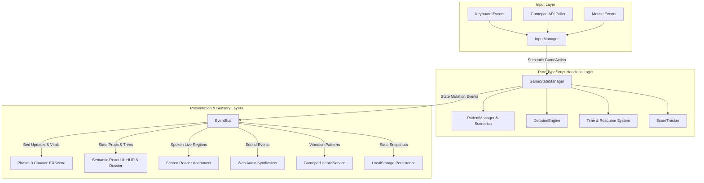
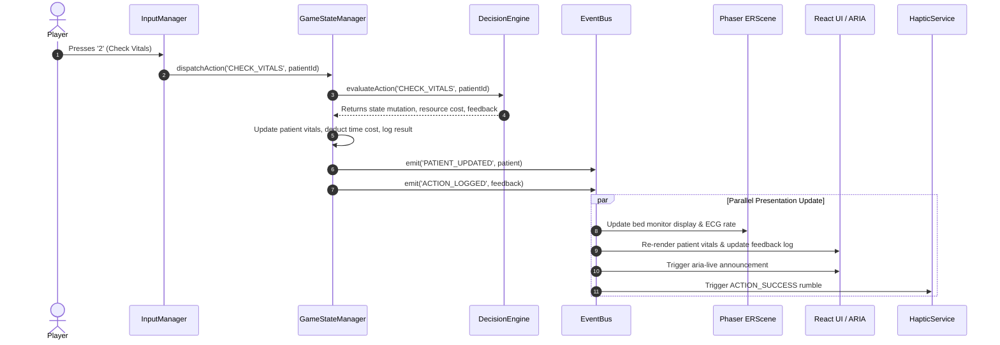

# Emergency Room — System Architecture

This document describes the high-level software architecture, module boundaries, data flow pipelines, and interaction models of **Emergency Room**.

---

## 1. Architectural Principles
1. **Decoupled Headless Core:** Complete separation of game simulation logic from rendering frameworks.
2. **Dual Synchronized Presentation:** 2D Canvas visualization and Accessible HTML/ARIA DOM are parallel views of the exact same state.
3. **Unidirectional Data Flow:** User inputs trigger commands on the core state manager, which emits events consumed by view and sensory layers.
4. **Resilience & Graceful Degradation:** The game functions fully even if Canvas, Audio, or Gamepad Haptics are completely disabled.

---

## 2. System Architecture Diagram

---

## 3. Core Component Breakdown

### 3.1. Headless Simulation Engine (`src/state/`)
* **`GameStateManager.ts`**: Canonical store holding the active shift clock, resource counts, array of active patients, selected patient ID, alert history, and score metrics.
* **`EventBus.ts`**: Typed pub/sub event bus decoupling state mutations from UI and rendering listeners.
* **`GameState.ts`**: Immutable state interface declarations and default state factories.

### 3.2. Patient & Decision Systems (`src/patients/` & `src/decisions/`)
* **`PatientManager.ts`**: Handles patient registration, vitals updates, and condition evaluations.
* **`patientScenarios.ts`**: Static catalog of the 5 fictional clinical scenarios with branching state graphs.
* **`DecisionEngine.ts`**: Evaluates player choices against prerequisites, deducts resource and time costs, executes state mutations, and generates rich feedback.

### 3.3. Accessible Presentation Layer (`src/accessibility/` & `src/components/`)
* **`Announcer.ts`**: Dedicated manager interfacing with `aria-live="polite"` and `aria-live="assertive"` DOM elements.
* **`PatientDossier.tsx`**: Semantic HTML representation of the selected patient, rendering headings, vitals tables, history lists, and action buttons.
* **`HUD.tsx`**: Real-time shift status bar displaying time remaining, bed occupancy, resource availability, and quick settings toggles.
* **`ActionPanel.tsx`**: Keyboard-navigable action list with single-key shortcuts, resource cost labels, and prerequisite badges.

### 3.4. 2D Visual Canvas Layer (`src/game/`)
* **`EmergencyRoomGame.ts`**: Instantiates and lifecycle-manages the Phaser 3 game instance inside a dedicated DOM container.
* **`ERScene.ts`**: Renders the 2D hospital ward: 5 animated patient beds, vitals monitor displays, triage nurse station, and status banners.
* **`Bed.ts`**: Visual game entity displaying patient bed state, pulse animations, and interactive click zones.

### 3.5. Input Dispatcher (`src/input/`)
* **`InputManager.ts`**: Unifies physical inputs into semantic commands (`NAVIGATE_NEXT`, `NAVIGATE_PREV`, `SELECT_BED`, `EXECUTE_ACTION`, `TOGGLE_PAUSE`).
* **`GamepadManager.ts`**: Polls connected gamepads, maps standard gamepad layout buttons, and routes directional inputs.
* **`KeyBindings.ts`**: Default configuration and custom keybinding dictionary persisted in `localStorage`.

### 3.6. Haptics & Audio (`src/accessibility/HapticService.ts` & `src/audio/`)
* **`HapticService.ts`**: Inspects `navigator.getGamepads()` for `vibrationActuator` support and outputs tuned pulse frequencies.
* **`AudioService.ts`**: Synthesizes soft hospital ambient hums, monitor blips, and alert tones using pure Web Audio API oscillators, accompanied synchronously by caption events.

---

## 4. Data Flow Sequence: Executing a Clinical Action

